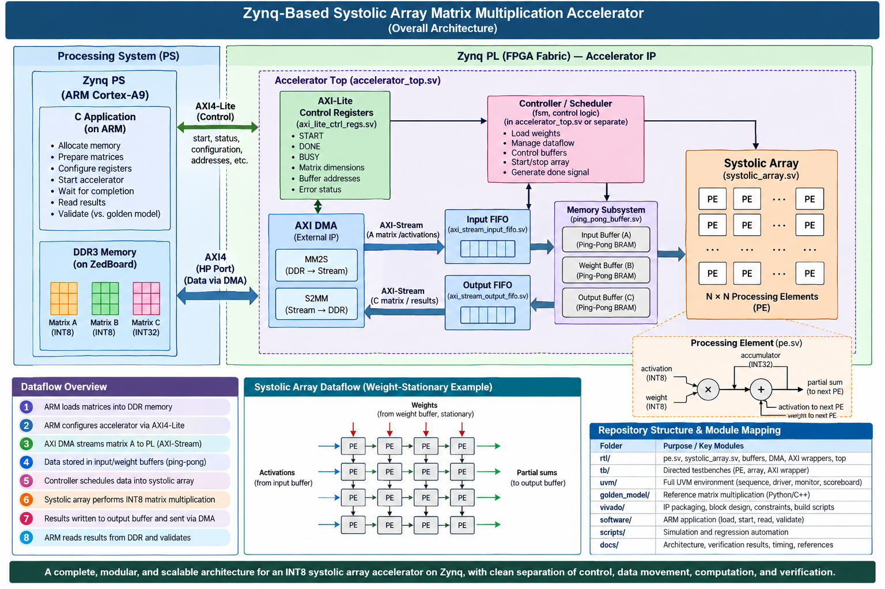
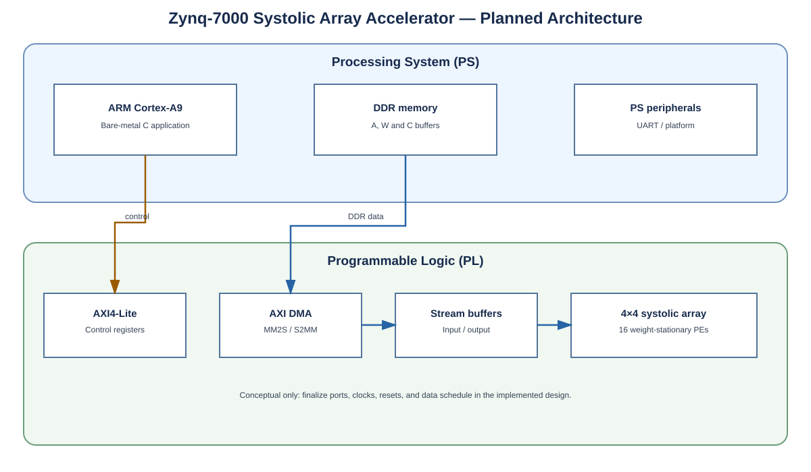
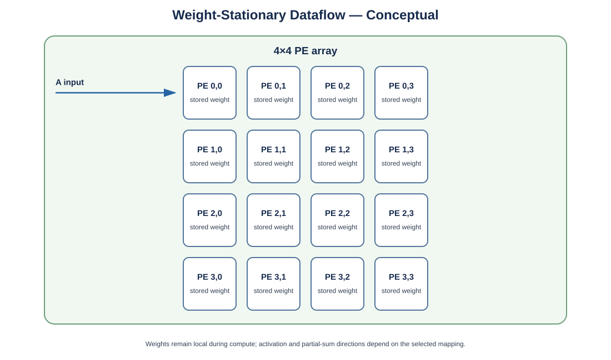
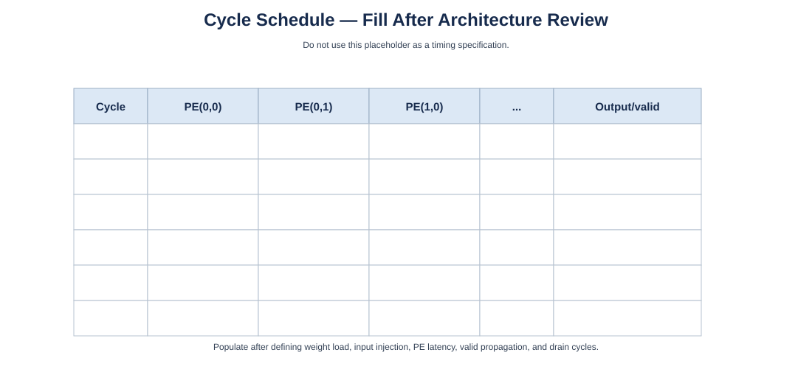
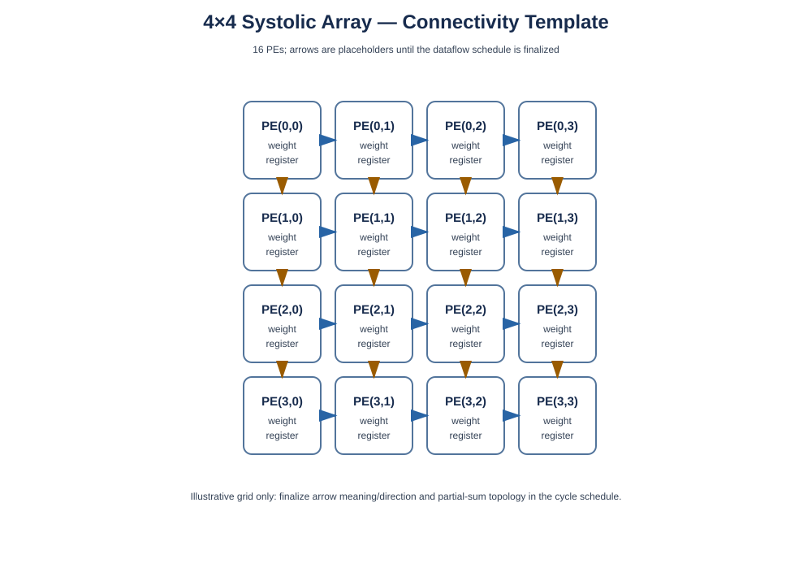

# 4×4 Systolic Array Matrix Multiplication Accelerator
### SystemVerilog RTL · UVM Verification · AMBA AXI · Zynq-7000 SoC


> **Project goal:** Design, verify, and implement a 4×4 signed INT8 weight-stationary systolic array for matrix multiplication. Integrate it into the programmable logic (PL) of a Zynq-7000 SoC and control it from an ARM Cortex-A9 processing-system (PS) application written in C. Use a C++ reference model as the mathematical oracle and build a self-checking SystemVerilog/UVM verification environment.

> **Status:** Work in progress. Planned architecture and proposed interfaces are identified as such until implemented and verified.

---

## Contents

- [1. Overview](#1-overview)
- [2. Objectives](#2-objectives)
- [3. Scope and baseline](#3-scope-and-baseline)
- [4. System architecture](#4-system-architecture)
- [5. Mathematical specification](#5-mathematical-specification)
- [6. Dataflow and execution](#6-dataflow-and-execution)
- [7. Block descriptions](#7-block-descriptions)
- [8. Repository layout](#8-repository-layout)
- [9. Development workflow](#9-development-workflow)
- [10. Project checklist](#10-project-checklist)
- [11. Milestones and deadlines](#11-milestones-and-deadlines)
- [12. Verification strategy](#12-verification-strategy)
- [13. Build and run](#13-build-and-run)
- [14. Results to report](#14-results-to-report)
- [15. Diagrams, screenshots, and evidence](#15-diagrams-screenshots-and-evidence)
- [16. Team workflow](#16-team-workflow)
- [17. Open design decisions and risks](#17-open-design-decisions-and-risks)
- [18. Learning resources](#18-learning-resources)
- [19. Definition of done](#19-definition-of-done)

---

## 1. Overview



Matrix multiplication is a fundamental operation in digital signal processing, computer vision, and machine-learning workloads. A CPU can compute a matrix product sequentially; a hardware accelerator can exploit parallel multiply-accumulate (MAC) operations.

This project implements a **4×4 systolic array containing 16 processing elements (PEs)**. The intended dataflow is **weight-stationary**: weights are loaded into PE-local storage and reused during computation, while activation data and partial sums move according to a defined schedule.

The project spans the complete hardware/software path:

1. Establish a trusted C++ software reference model.
2. Specify PE behavior, dataflow, and cycle timing.
3. Implement and simulate the PE and 4×4 array in SystemVerilog.
4. Build directed and self-checking regression tests.
5. Add assertions, functional coverage, and a UVM environment.
6. Integrate AXI4-Lite control and AXI4-Stream data interfaces.
7. Connect AXI DMA and DDR buffers in a Zynq-7000 design.
8. Write a bare-metal C application for the ARM Cortex-A9.
9. Validate the accelerator on the target board and report correctness, latency, throughput, and FPGA resource use.

The existing C++ golden model provides **mathematical expected results**. It does not model PE timing, AXI transactions, DMA behavior, or FPGA implementation. A Python companion may later be added for vector generation and additional verification workflows.


### Project summary

| Item | Baseline |
|---|---|
| Compute | Matrix multiplication, `C = A × W` |
| Physical array | 4×4, 16 PEs |
| Dataflow | Weight-stationary (exact schedule to be frozen) |
| Activation and weight | Signed INT8 |
| Product | Signed INT16 |
| Accumulator/output | Signed INT32 |
| RTL | SystemVerilog |
| Verification | Directed SV, assertions, coverage, UVM |
| Target platform | Zynq-7000, ZedBoard |
| FPGA device family | XC7Z020; exact part from Vivado project settings |
| PS application | C, initially bare-metal |
| Control path | Planned AXI4-Lite |
| Bulk data path | Planned AXI DMA + AXI4-Stream |
| Mathematical oracle | Existing C++ golden model |

---

## 2. Objectives

### Engineering objectives

- Implement a correct signed MAC PE and connect 16 PEs into a 4×4 array.
- Specify reset, weight loading, compute scheduling, valid propagation, output ordering, and completion.
- Separate software control from bulk data movement.
- Transfer matrices between PS-accessible DDR memory and the PL accelerator.
- Compare RTL and board outputs against the C++ reference model.
- Produce reproducible simulation, synthesis, timing, and board-test evidence.

### Learning objectives

- Fixed-width signed arithmetic and datapath design.
- Systolic dataflow, PE connectivity, pipeline latency, and throughput.
- SystemVerilog RTL and simulation semantics.
- Self-checking testbenches, assertions, functional coverage, and UVM.
- AXI4-Lite, AXI4-Stream, AXI DMA, and backpressure.
- Zynq PS/PL partitioning, DDR buffers, and cache synchronization.
- FPGA synthesis, implementation, timing analysis, and resource reporting.

---

## 3. Scope and baseline

### Fixed baseline

- The physical compute array is 4×4 (16 PEs).
- Activations and weights are signed 8-bit two's-complement values.
- Each product is represented as signed 16-bit.
- Products are sign-extended before accumulation into signed 32-bit results.
- The baseline computes ordinary matrix multiplication: `C = A × W`.
- No bias, activation function, quantization, rounding, saturation, or ABFT is included in the first version.
- The C++ model is architecture-independent and serves as the mathematical reference.
- The software model can support compatible rectangular dimensions from 1 through 16, but **this does not mean the physical 4×4 hardware supports every such shape**. Hardware shape mapping, padding, or tiling must be separately designed and verified.

### Deferred from the first version

- Physical 8×8 or larger array.
- Folded-array execution and general-purpose tiling.
- Dedicated convolution hardware mode.
- Linux/PetaLinux drivers.
- Scatter-gather DMA.
- Multiple clock domains/CDC.
- Quantized neural-network post-processing.
- Advanced power/performance optimization.

### Design contract to freeze before final RTL

- PE interface and exact sequential behavior.
- Weight assignment and loading protocol.
- Activation and partial-sum movement directions.
- Whether partial sums move between PEs or are accumulated locally.
- Valid/data alignment and PE latency.
- Reset polarity and reset style.
- Priority when load and compute controls overlap.
- Cycle-by-cycle schedule and output ordering.
- Stream beat packing, `TLAST`, and `TKEEP` semantics.
- AXI register map, status bits, and error behavior.

---

## 4. System architecture

### 4.1 Planned top-level architecture



*Figure 1. Planned PS/PL architecture. Replace or revise this diagram when the Vivado block design is finalized.*

```text
                         ZYNQ-7000 SoC
┌─────────────────────────────────────────────────────────────┐
│ Processing System (PS)                                      │
│  ARM Cortex-A9 ── Bare-metal C application                  │
│        │ AXI4-Lite control          │ Input/output buffers  │
│        ▼                            ▼                       │
│  Accelerator registers             DDR memory               │
└───────────────┬────────────────────────────┬────────────────┘
                │ Control                    │ Memory access
                ▼                            ▼
┌─────────────────────────────────────────────────────────────┐
│ Programmable Logic (PL)                                     │
│  AXI4-Lite registers                AXI DMA                 │
│        │                       MM2S ──►  │  ◄── S2MM         │
│        ▼                                AXI4-Stream          │
│  Accelerator controller                    │                │
│                                     Input/weight handling   │
│                                             │               │
│                                     4×4 systolic array      │
│                                             │               │
│                                      Output collector      │
│                                             │               │
│                                         AXI4-Stream         │
└─────────────────────────────────────────────────────────────┘
```

This is the intended architecture, not a claim that integration is already complete. Final AXI ports, clock/reset topology, address ranges, and DMA settings must be recorded from the implemented Vivado design.

### 4.2 Control path vs. data path

| Interface/block | Purpose | Examples |
|---|---|---|
| AXI4-Lite | Low-bandwidth control/status | Start, busy, done, error, configuration |
| AXI4-Stream | Payload movement | Packed activation, weight, and result beats |
| AXI DMA | Bulk data movement | DDR → stream (MM2S); stream → DDR (S2MM) |
| DDR | Large software-visible buffers | Inputs, weights, output matrix |
| BRAM/FIFO | Local PL buffering | Stream elasticity, staging, or weight storage as required |

The intended architecture avoids writing every matrix element through AXI4-Lite registers. AXI DMA handles bulk payload movement; AXI4-Lite configures the accelerator and DMA.

---

## 5. Mathematical specification

For compatible matrices:

\[
A \in \mathbb{Z}^{M\times K},\quad
W \in \mathbb{Z}^{K\times N},\quad
C \in \mathbb{Z}^{M\times N}
\]

\[
C[i][j]=\sum_{k=0}^{K-1} A[i][k]\,W[k][j]
\]

The dimension constraint is `A.columns == W.rows`.

### Numeric representation

| Quantity | Width | Interpretation |
|---|---:|---|
| Activation `A[i][k]` | 8 bits | Signed two's-complement |
| Weight `W[k][j]` | 8 bits | Signed two's-complement |
| Product | 16 bits | Signed INT8 × INT8 |
| Accumulator | 32 bits | Signed sum |
| Output `C[i][j]` | 32 bits | Signed result |

No saturation is performed. RTL and software must agree on signedness and sign extension. Include `-128`, `127`, mixed signs, zero values, and accumulation boundary cases in testing.

### Operation counts

For a compatible `M×K` by `K×N` product:

- Multiplications: `M × K × N`
- Additions: `M × N × (K − 1)`
- MAC terms: `M × K × N`
- Primitive operations (as counted here): multiplications + additions

These are mathematical operation counts, not hardware cycle counts.

### Known-answer example

```text
A =                 W =
[ 1  2  3  4 ]      [ 1  0  2  1 ]
[ 5  6  7  8 ]      [ 0  1  1  2 ]
[ 9 10 11 12 ]      [ 2  1  0  1 ]
[13 14 15 16 ]      [ 1  2  1  0 ]
```

Expected result:

```text
C = A × W =
[ 11  13   8   8 ]
[ 27  29  24  24 ]
[ 43  45  40  40 ]
[ 59  61  56  56 ]
```

For example, `C[0][0] = 1×1 + 2×0 + 3×2 + 4×1 = 11`.

Use this same vector in the C++ model, RTL regression, and board-level validation.

---

## 6. Dataflow and execution

### 6.1 Weight-stationary dataflow



*Figure 2. Planned weight-stationary dataflow. Update it after the exact PE mapping and schedule are frozen.*

In a weight-stationary architecture, each PE stores its assigned weight locally and reuses it during the relevant computation interval. Activations and partial sums move according to the chosen topology and schedule. Weight-stationary designs can differ in their precise movement directions and accumulation strategy; the project must define one exact mapping.

### 6.2 Intended transaction lifecycle

1. The C application prepares input and weight buffers in DDR.
2. Software performs required cache clean/synchronization operations before DMA reads the buffers.
3. Software configures accelerator control/status registers.
4. Software configures the receive path and DMA in the order required by the selected design.
5. DMA transfers payloads from DDR to the PL through MM2S and AXI4-Stream.
6. Input/weight logic receives and stores values.
7. The controller runs the agreed compute schedule.
8. The array computes the matrix product.
9. The output collector packs results into AXI4-Stream beats.
10. S2MM DMA writes output data into the DDR output buffer.
11. Software waits for completion and performs the required cache invalidation/synchronization.
12. The C application compares the output against the expected result.

The final design must specify whether activations and weights share a stream, the start ordering, and whether completion uses polling or interrupts.

### 6.3 AXI4-Stream handshake

A beat transfers on a clock edge when both `TVALID` and `TREADY` are asserted:

```text
transfer = TVALID && TREADY
```

The producer must preserve the current beat while stalled. The design specification must define data packing, packet boundaries (`TLAST`), byte qualifiers (`TKEEP`), and behavior under backpressure.

### 6.4 Conceptual controller

```text
IDLE → LOAD_WEIGHTS → PREPARE → COMPUTE → DRAIN → DONE
  ↑                                                    │
  └──────────────────── next transaction ─────────────┘
```

This is a conceptual FSM only. State encoding, error recovery, and the exact meaning of `DONE` must be specified before implementation.



*Figure 3. Placeholder for the reviewed cycle-by-cycle timing schedule. Create this before freezing the PE/array RTL.*

---

## 7. Block descriptions

### 7.1 Processing element (PE)

**Responsibility:** Store/use an assigned weight and perform the specified signed multiply-accumulate operation with correct timing.

Questions to resolve:
- When is the weight loaded?
- When does the accumulator clear or accept a partial sum?
- How is the product sign-extended?
- How are valid and data signals aligned?
- What happens during reset or simultaneous load/compute?

**Deliverables:** PE RTL, interface specification, PE unit testbench, assertions, waveform, and latency description.

### 7.2 4×4 systolic array

**Responsibility:** Connect 16 PEs and implement the agreed dataflow and cycle schedule.

**Deliverables:** Array RTL, connectivity diagram, timing table, known-answer test, boundary/random tests, output comparison, and latency measurement.



*Figure 4. Planned 4×4 PE connectivity. Update after the mapping is finalized.*

### 7.3 Input and weight handling

**Responsibility:** Accept input beats, decode/pack elements, and deliver them in the correct order to the array. Possible components include FIFOs, a weight buffer/register bank, and loader control.

**Deliverables:** Stream format, beat-to-element mapping, load-complete condition, overflow/underflow behavior, and stall tests.

### 7.4 Output collector

**Responsibility:** Capture completed outputs and serialize them in the specified order.

**Deliverables:** Output ordering, buffering policy, `TVALID/TREADY` behavior, `TLAST` rule, and backpressure tests.

### 7.5 Controller and AXI4-Lite registers

**Responsibility:** Expose control/status and coordinate loading, compute, and output completion.

The following is a **proposed register map**, not a final contract:

| Offset | Proposed register | Purpose |
|---:|---|---|
| `0x00` | CONTROL | Start/reset/interrupt controls, as defined |
| `0x04` | STATUS | Busy/done/error flags |
| `0x08` | M | Rows of A/C, if programmable |
| `0x0C` | K | Inner dimension |
| `0x10` | N | Columns of W/C |
| `0x14` | INPUT_LENGTH | Input transfer length, if required |
| `0x18` | WEIGHT_LENGTH | Weight transfer length, if required |
| `0x1C` | OUTPUT_LENGTH | Output transfer length, if required |

For a fixed 4×4 first version, dimensions may be constants instead of programmable registers. Only implement registers that the design actually needs.

### 7.6 AXI DMA

**Responsibility:** Move payloads between memory and AXI4-Stream.

- **MM2S:** memory-mapped source → stream.
- **S2MM:** stream → memory-mapped destination.

**Deliverables:** DMA configuration, buffer addresses/lengths, completion/error handling, and data-integrity tests.

### 7.7 PS bare-metal C application

The application runs on the ARM Cortex-A9. It orchestrates the accelerator; it does not implement the systolic datapath. Loading/configuring the FPGA bitstream is normally a separate platform/programming step.

Responsibilities:
- Initialize the platform and peripherals.
- Prepare matrices and expected output.
- Configure accelerator registers and DMA.
- Start transfers and compute in the agreed order.
- Wait for completion and check errors.
- Perform required cache maintenance.
- Compare received output with expected results.
- Print PASS/FAIL and timing information.

Suggested files:

| File | Responsibility |
|---|---|
| `main.c` | Top-level flow |
| `accelerator.c/.h` | Custom register access |
| `dma.c/.h` | DMA setup and completion |
| `input.c/.h` | Test matrices and data generation |
| `verify.c/.h` | Output comparison and diagnostics |

Driver calls depend on the selected Vitis version and BSP.

### 7.8 C++ golden model

The C++ model is the mathematical oracle. Keep it independent of the RTL and do not model PE timing, FSMs, AXI, DMA, or BRAM inside it.

Use it for known-answer, boundary, deterministic-random, RTL, and board-level checks. A Python companion can be added later for test-vector generation and cocotb.

---

## 8. Repository layout

```text
systolic-array-accelerator/
├── README.md
├── LICENSE
├── .gitignore
├── golden_model/
│   └── cpp/
│       ├── include/
│       ├── src/
│       ├── tests/
│       └── CMakeLists.txt
├── rtl/
│   ├── pe/
│   ├── systolic/
│   ├── buffers/
│   ├── control/
│   ├── stream/
│   └── top/
├── verification/
│   ├── directed/
│   ├── assertions/
│   ├── coverage/
│   └── uvm/
├── ps_software/
│   ├── include/
│   ├── src/
│   └── README.md
├── vivado/
│   ├── block_design/
│   ├── constraints/
│   ├── ip/
│   └── README.md
├── tests/
│   ├── vectors/
│   └── expected/
└── doc/
    ├── architecture/
    ├── specifications/
    ├── reports/
    ├── resources/
    │   ├── diagrams/
    │   ├── waveforms/
    │   ├── vivado/
    │   ├── board/
    │   └── papers/
    └── README.md
```

- `golden_model/`: mathematical software reference.
- `rtl/`: synthesizable RTL.
- `verification/`: testbench, UVM, assertions, coverage, regression scripts.
- `ps_software/`: ARM-side C application.
- `vivado/`: hardware design notes, constraints, and project guidance.
- `tests/`: shared vectors and expected results.
- `docs/architecture/`: architecture decisions and diagrams.
- `docs/specifications/`: timing, interface, register, and stream contracts.
- `docs/reports/`: regression, synthesis, timing, and board reports.
- `docs/resources/`: figures and screenshots referenced by documentation.

Do not commit simulator work directories or large generated Vivado output indiscriminately. Configure `.gitignore` early.

---

## 9. Development workflow

### Phase 0 — Scope and repository setup
- [ ] Confirm scope, widths, board, and team conventions.
- [ ] Create repository and `.gitignore`.
- [ ] Record design decisions and open questions.
- [ ] Add architecture diagrams.

**Exit criteria:** Team agrees on the baseline and deferred features.

### Phase 1 — C++ golden model
- [ ] Complete model API and dimension/range checks.
- [ ] Add automated PASS/FAIL tests.
- [ ] Test rectangular cases, signed boundaries, zero values, and invalid dimensions.
- [ ] Add deterministic random tests.
- [ ] Document build/test commands.

**Exit criteria:** Mismatches fail the test process; known-answer output is reproducible.

### Phase 2 — Freeze PE and array timing
- [ ] Choose exact weight-stationary mapping.
- [ ] Define PE ports and sequential behavior.
- [ ] Define reset, load, accumulation, valid, and output behavior.
- [ ] Create cycle-by-cycle schedule.
- [ ] Define input/output order and stream format.

**Exit criteria:** Reviewers can trace each PE's values and state for every cycle without guessing.

### Phase 3 — PE RTL
- [ ] Implement PE.
- [ ] Test signed arithmetic and sign extension.
- [ ] Test reset, weight load, and valid alignment.
- [ ] Add assertions and waveform evidence.

**Exit criteria:** PE regression passes and latency matches the specification.

### Phase 4 — 4×4 array RTL
- [ ] Instantiate/connect 16 PEs.
- [ ] Implement loading, schedule, and output collection.
- [ ] Pass the known-answer example.
- [ ] Test zero, signed-boundary, and random matrices.
- [ ] Measure latency with defined start/end events.

**Exit criteria:** All tests in the declared hardware scope match the reference model.

### Phase 5 — SystemVerilog verification
- [ ] Build self-checking directed testbench.
- [ ] Add driver, monitor, and scoreboard.
- [ ] Connect the reference model.
- [ ] Add assertions and functional coverage.
- [ ] Add constrained-random tests and reproducible seeds.

**Exit criteria:** Regression is self-checking and produces actionable failure reports.

### Phase 6 — UVM
- [ ] Define transaction classes.
- [ ] Build sequences, sequencer, driver, monitor, agent, environment, and scoreboard.
- [ ] Add reset/load/compute/error scenarios.
- [ ] Add coverage goals and regression configuration.

**Exit criteria:** UVM regression checks outputs and control behavior without depending on waveform inspection.

### Phase 7 — AXI and DMA integration
- [ ] Freeze AXI4-Lite register map.
- [ ] Freeze stream packing and packet rules.
- [ ] Integrate stream endpoints and required buffers.
- [ ] Configure MM2S and S2MM.
- [ ] Test backpressure, boundaries, reset, and error paths.

**Exit criteria:** End-to-end transfer/compute/return is checked and repeatable.

### Phase 8 — Vivado implementation
- [ ] Create Zynq block design.
- [ ] Configure clocks and resets.
- [ ] Connect AXI and validate address map.
- [ ] Synthesize and implement.
- [ ] Review timing and resource reports.
- [ ] Export the hardware platform.

**Exit criteria:** Build succeeds and timing/resource evidence is saved.

### Phase 9 — PS C and board validation
- [ ] Initialize platform and peripherals.
- [ ] Prepare input/output buffers.
- [ ] Configure accelerator and DMA.
- [ ] Apply required cache maintenance.
- [ ] Run known-answer and multiple-input tests.
- [ ] Compare output and record timings.

**Exit criteria:** Board output matches the reference and the run steps are documented.

### Phase 10 — Report and release
- [ ] Capture diagrams, waveforms, block design, and board output.
- [ ] Report correctness, latency, throughput, and resource use.
- [ ] Document limitations and future work.
- [ ] Tag a reproducible release/commit.

**Exit criteria:** Another team member can reproduce the core demonstration from the documentation.

---

## 10. Project checklist

Mark an item complete only when there is evidence (reviewed spec, passing test, report, or commit).

### Specifications
- [ ] Scope and baseline agreed
- [ ] System architecture diagram
- [ ] PE interface specification
- [ ] Weight-stationary mapping diagram
- [ ] Cycle-by-cycle timing table
- [ ] Reset and valid behavior defined
- [ ] Input/output stream format defined
- [ ] AXI4-Lite register map finalized
- [ ] Completion/error semantics defined

### C++ reference model
- [ ] Automated PASS/FAIL tests
- [ ] Rectangular matrix tests
- [ ] Signed-boundary and zero tests
- [ ] Invalid-dimension tests
- [ ] Deterministic random regression
- [ ] Build/test instructions recorded

### RTL
- [ ] PE implemented and verified
- [ ] 4×4 array implemented
- [ ] Loader and output collector verified
- [ ] Known-answer test passes
- [ ] Boundary and random tests pass
- [ ] Latency documented

### Verification
- [ ] Directed SV regression
- [ ] Scoreboard/reference-model integration
- [ ] Assertions
- [ ] Functional coverage
- [ ] Constrained-random tests
- [ ] UVM environment
- [ ] Regression logs and seeds archived

### AXI/DMA
- [ ] AXI4-Lite register access verified
- [ ] Start/busy/done/error behavior verified
- [ ] AXI4-Stream backpressure verified
- [ ] `TLAST`/`TKEEP` behavior verified
- [ ] MM2S integration
- [ ] S2MM integration
- [ ] DMA errors and completion tested
- [ ] End-to-end data integrity verified

### FPGA and board
- [ ] Vivado block design completed
- [ ] Clock/reset and address map checked
- [ ] Synthesis completed
- [ ] Implementation/timing reviewed
- [ ] LUT/FF/BRAM/DSP usage recorded
- [ ] PS C application completed
- [ ] Cache synchronization handled
- [ ] Board known-answer test passes
- [ ] Board logs and timing recorded

### Documentation/release
- [ ] README updated
- [ ] Diagrams and waveforms added
- [ ] Vivado screenshots/reports added
- [ ] Board result evidence added
- [ ] Limitations/future work documented
- [ ] Clean-checkout reproduction checked

---

## 11. Milestones and deadlines

**Calendar dates are intentionally TBD** until the team agrees on the project start date and review schedule. The week ranges below are planning estimates, not commitments.

| Milestone | Suggested window | Deliverable | Evidence |
|---|---|---|---|
| M0 — Scope/repository | Week 1 | Repo and reviewed contract | Review/commit |
| M1 — Golden model | Week 1 | Self-checking C++ tests | Test log |
| M2 — Dataflow freeze | Weeks 1–2 | PE spec and cycle table | Reviewed spec |
| M3 — PE RTL | Weeks 2–3 | PE + unit tests | Passing regression |
| M4 — 4×4 RTL | Weeks 3–4 | Array and output collection | Reference match |
| M5 — SV verification | Weeks 4–5 | Testbench, assertions, coverage | Regression report |
| M6 — UVM | Weeks 5–7 | Reusable UVM environment | UVM report |
| M7 — AXI/DMA | Weeks 7–9 | AXI and DMA integration | Integration tests |
| M8 — FPGA build | Weeks 9–10 | Bitstream/platform | Timing/resource report |
| M9 — PS C/board | Weeks 10–11 | Bare-metal app and board run | Output log |
| M10 — Release | Week 12 | Final report/demo | Reproducible release |

### Team-agreed dates

| Milestone | Deadline | Owner | Status |
|---|---|---|---|
| M0 — Scope/repository | TBD | TBD | In progress |
| M1 — Golden model | TBD | TBD | In progress / review |
| M2 — Dataflow freeze | TBD | TBD | Not started |
| M3 — PE RTL | TBD | TBD | Not started |
| M4 — 4×4 RTL | TBD | TBD | Not started |
| M5 — SV verification | TBD | TBD | Not started |
| M6 — UVM | TBD | TBD | Not started |
| M7 — AXI/DMA | TBD | TBD | Not started |
| M8 — FPGA build | TBD | TBD | Not started |
| M9 — PS C/board | TBD | TBD | Not started |
| M10 — Release | TBD | TBD | Not started |

---

## 12. Verification strategy

Verification accompanies each block; it is not postponed until the RTL is finished.

| Layer | Question | Method |
|---|---|---|
| C++ model | Is the mathematical oracle correct? | Unit and regression tests |
| PE | Does one PE obey arithmetic and timing contract? | Directed SV tests, assertions |
| Array | Does the connected array compute correctly? | Self-checking SV scoreboard |
| Control | Are reset/start/busy/done/error correct? | Directed tests, assertions |
| Stream | Are beats preserved through stalls and boundaries? | Backpressure tests, protocol checks |
| UVM | Does the DUT pass varied scenarios? | Sequences, scoreboard, coverage |
| Board | Does integrated hardware match the reference? | Bare-metal C comparison |

### Required test categories

- Known-answer matrix.
- Zero inputs and zero weights.
- Identity matrix where supported by the selected hardware mapping.
- Positive, negative, and mixed-sign values.
- INT8 boundaries `-128` and `127`.
- Accumulation across the supported inner dimension.
- Reset and reset recovery.
- Weight-load/compute sequencing.
- Invalid command/configuration handling.
- Stream backpressure and packet boundaries.
- DMA completion/error handling.
- Repeated transactions to detect stale state or outputs.

The scoreboard should calculate expected results using the mathematical reference model, not by copying the DUT's internal PE schedule. On failure, report the seed, inputs, output index, expected value, and actual value.

---

## 13. Build and run

Commands must be verified against the actual project and tool versions before publication.

### C++ golden model

From `golden_model/cpp/`:

```bash
cmake -S . -B build
cmake --build build
```

Document the actual executable and test command after the CMake target/test harness is finalized.

### RTL simulation

Provide a simulator-specific script that compiles the DUT/testbench, runs directed and random tests, returns a failing exit status on mismatch, and saves logs/seeds. For example, once implemented:

```bash
./scripts/run_rtl_regression.sh
```

### UVM regression

Document simulator/version, compile options, test name, random seed, configuration, and coverage output. UVM support and licensing depend on the simulator.

### FPGA and PS software

Document:
- Vivado/Vitis versions and FPGA part.
- Clock configuration and address map.
- Bitstream/hardware-platform revision.
- BSP and driver configuration.
- Application build/run steps.
- Console settings and expected output.
- Failure and recovery behavior.

Do not claim commands or hardware tests passed until they have actually been run.

---

## 14. Results to report

Functional correctness and performance are separate results. A correct answer alone is not a performance measurement.

### Functional regression

Record date, Git commit, tool/version, test name, seed, pass/fail counts, coverage summary, and known limitations.

### FPGA implementation

| Metric | Result |
|---|---|
| FPGA part | Exact part from Vivado settings |
| Target clock | TBD |
| Achieved clock / worst slack | TBD |
| LUTs | TBD |
| Flip-flops | TBD |
| BRAM | TBD |
| DSP slices | TBD |
| Timing status | TBD |

### Latency and throughput

Measure separately where possible:
- Input DMA transfer time.
- Weight-load time.
- Accelerator compute latency.
- Output DMA transfer time.
- End-to-end application latency.
- Sustained throughput over repeated transactions.

Define the start/end events, dimensions, clock frequency, and timing boundary for every reported number.

---

## 15. Diagrams, screenshots, and evidence

Keep project-created figures and screenshots under `doc/resources/`. Prefer original diagrams. If an external figure or code sample is reused, record its source and license/permission status in `doc/resources/papers/references.md`.

### Resource folders

```text
doc/resources/
├── diagrams/   # Architecture, PE, array, dataflow, timing
├── waveforms/  # Representative simulation waveforms
├── vivado/     # Block design, address editor, timing/resource reports
├── board/      # Board setup and serial-console results
└── papers/     # Reference list, paper notes, attribution
```

### Suggested filenames

| File | What to capture |
|---|---|
| `diagrams/system_architecture.png` | PS, PL, DDR, DMA, AXI and accelerator |
| `diagrams/pe_block_diagram.png` | PE ports, weight register, multiplier, accumulator |
| `diagrams/systolic_array_4x4.png` | 16 PEs and connections |
| `diagrams/weight_stationary_dataflow.png` | Weight/activation/partial-sum movement |
| `diagrams/cycle_schedule.png` | Cycle-by-cycle schedule |
| `diagrams/axi_dataflow.png` | AXI-Lite control and AXI-Stream payload |
| `waveforms/pe_mac_waveform.png` | PE arithmetic and valid timing |
| `waveforms/array_known_answer_waveform.png` | Array computation/output timing |
| `waveforms/axi_stream_backpressure.png` | Stall and handshake behavior |
| `vivado/block_design.png` | Final Vivado block design |
| `vivado/address_editor.png` | Address map |
| `vivado/synthesis_utilization.png` | Resource utilization |
| `vivado/timing_summary.png` | Timing summary |
| `board/zedboard_setup.jpg` | Physical setup (optional) |
| `board/end_to_end_result.png` | Board output matching reference |

### Referencing a local image

```markdown

*Figure 1. Planned PS/PL architecture.*
```

Only add the Markdown image reference once the file exists. The starter bundle includes placeholder SVG diagrams for the system architecture, PE, 4×4 array, weight-stationary dataflow, cycle schedule, and AXI dataflow. Replace them with reviewed diagrams as the design is finalized.

---

## 16. Team workflow

For a four-person team, assign a primary owner to each workstream. Responsibilities may rotate for learning, but every deliverable should have one owner and a reviewer.

| Workstream | Responsibility | Dependency |
|---|---|---|
| Architecture/RTL | PE, array, controller, timing | Frozen design contract |
| Verification | Tests, assertions, coverage, UVM | Stable interfaces and golden model |
| AXI/Vivado | AXI, DMA, block design | RTL interfaces |
| PS software/validation | C app, buffers, DMA control, board tests | Register/stream contracts |

### Collaboration rules

- Use feature branches and pull requests.
- Keep commits focused and descriptive.
- Review interface changes before merging.
- Never silently change widths, stream order, or reset semantics.
- Attach relevant test evidence to RTL changes.
- Record design decisions in `docs/architecture/decisions.md`.
- Update this README when scope or contracts change.
- Keep generated tool output out of source control unless intentionally included.

---

## 17. Open design decisions and risks

| Open item | Why it matters | Action |
|---|---|---|
| Array schedule | Wrong timing assumptions cause incorrect RTL | Review cycle table before RTL freeze |
| Weight loading | Defines PE ports and data format | Specify loading protocol |
| Partial-sum mapping | Determines PE connectivity/output timing | Document exact movement |
| Matrix shape support | Software model range differs from physical array | Define first hardware workload |
| Stream packing | SW, DMA, and RTL must agree on byte order | Publish stream specification |
| `TLAST` semantics | Packet framing affects transfer completion | Define exact packet boundary |
| Cache coherency | CPU/DMA can observe stale buffer contents | Use correct BSP cache APIs |
| Clock/reset topology | Integration mistakes can break the system | Document clocks and resets |
| Tool compatibility | Simulator/UVM support varies | Select and record tool versions |
| Scope creep | Advanced features can delay the baseline | Defer folding/Linux/optimization |

---

## 18. Learning resources

Use courses and tutorials to learn concepts, then use official manuals to confirm implementation-specific details. Third-party RTL is a study reference, not a substitute for a reviewed specification.

### Systolic-array architecture

- [NTHU OpenCourseWare — Systolic Array lecture](https://ocw.nthu.edu.tw/chapter/246/2767)
- [Telesens — Systolic architectures and weight-stationary dataflow](https://telesens.co/2018/07/30/systolic-architectures/)
- [4×4 weight-stationary RTL example](https://github.com/mvgprasanth/Systolic-Array-Matrix-Multiplication)

### SystemVerilog and UVM

- [SystemVerilog Academy — courses](https://www.systemverilogacademy.com/courses)
- [SystemVerilog Academy — reusable UVM agents](https://www.systemverilogacademy.com/courses/uvm-in-systemverilog-2-writing-reusable-agents-in-uvm)
- [SystemVerilog Academy — UVM and VIP](https://www.systemverilogacademy.com/courses/uvm-in-systemverilog-3-learn-the-architecture-and-code-your-vip)
- [VLSI Mentor — free learning library](https://www.vlsimentor.com/learnings)

### AXI and protocol verification

- [VLSI Mentor — AXI and AXI VIP](https://www.vlsimentor.com/axi/axi-vip)
- [MasterVLSI — playlists and AXI lectures](https://www.mastervlsi.com/playlists)
- [Open-source AXI4 UVM VIP example](https://github.com/wendigp/Development-of-AXI4-Verification-IP-VIP)
- [KVIPS — AMBA verification IP](https://github.com/kiranreddi/kvips)

### Zynq PS/PL and DMA

- [Zynq PS/PL architecture course](https://lay007.github.io/zynq-sdr-course/zynq-ps-pl-architecture/)
- [PS/PL AXI-Lite mailbox lab](https://lay007.github.io/zynq-sdr-course/en/labs/lab-5-12-zynq-ps-pl-mailbox/)
- [Zynq-7000 DMA with custom AXI IP and C](https://github.com/YannosK/Zynq-7000_DMA_Example_with_Custom_AXI_IP_Peripheral)
- [Hands-on Zynq DMA tutorial](https://hugobrh.dev/posts/DMA_FFT_ON_ZYNQ/)

### Official implementation references

- [Zynq-7000 SoC Technical Reference Manual (UG585)](https://docs.amd.com/r/en-US/ug585-zynq-7000-SoC-TRM/Zynq-7000-SoC-Documents)
- [Vivado AXI Reference Guide (UG1037)](https://docs.amd.com/v/u/en-US/ug1037-vivado-axi-reference-guide)
- [AXI DMA Product Guide (PG021)](https://docs.amd.com/r/en-US/pg021_axi_dma)

---

## 19. Definition of done

- [ ] Mathematical contract and physical 4×4 mapping are documented.
- [ ] PE and array timing are specified cycle by cycle.
- [ ] RTL passes self-checking tests against the C++ reference.
- [ ] Assertions and meaningful functional coverage are included.
- [ ] UVM regression is reproducible and results are archived.
- [ ] AXI control, streaming, and DMA integration pass tests.
- [ ] Vivado build and timing/resource reports are reviewed.
- [ ] PS C application transfers data and checks results correctly.
- [ ] Board-level results match the reference model.
- [ ] Documentation and evidence are up to date.
- [ ] A clean checkout can reproduce the core demonstration.

---
